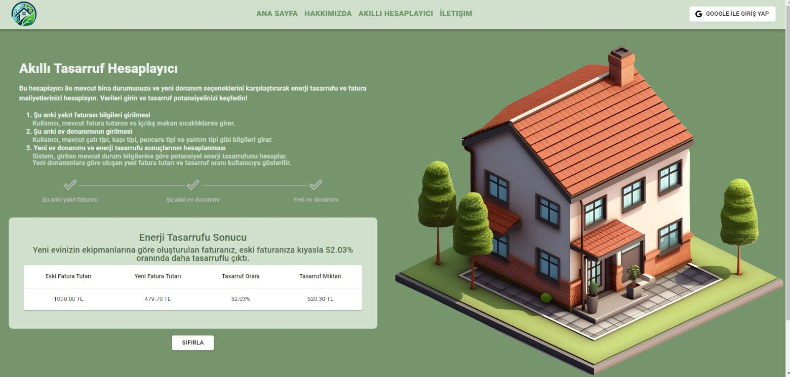

# İzole Enerji – Building Insulation & Energy Saving Platform  
  
  
  
  
  

---

## 📖 Project Overview  
**İzoleEnerji** is a **thesis project** designed and developed to provide a **calculation and recommendation engine** for optimizing **building insulation** and promoting **energy savings**.  

This project aims to give users **actionable insights** for reducing energy consumption while also supporting sustainability goals.  

🏆 Selected among the **Top Thesis Showcases** and supported by **TÜBİTAK** (The Scientific and Technological Research Council of Turkey).  

---

## 🛠️ Tech Stack
- **Backend:** .NET Core, Entity Framework, AutoMapper  
- **Frontend:** React.js, Axios, Bootstrap  
- **Database:** SQL Server  
- **Other:** REST API architecture, Responsive UI  

---

## 🚀 Key Features
- **Calculation Engine** → Provides recommendations for insulation improvements.  
- **Dynamic UI** → Built with React.js for an interactive and modern user experience.  
- **Energy Savings Reports** → Offers insights on potential energy reduction.  
- **Responsive Design** → Optimized for multiple devices using Bootstrap.  
- **Clean Architecture** → AutoMapper & Entity Framework used for scalable backend.  

---

## 📸 Screenshot  

Here’s a preview of the calculation page:  

  

---

## ⚙️ Installation & Setup

1. Clone the repository:
```bash
git clone https://github.com/ahmetakinci/IzoleEnerji.git
cd IzoleEnerji
